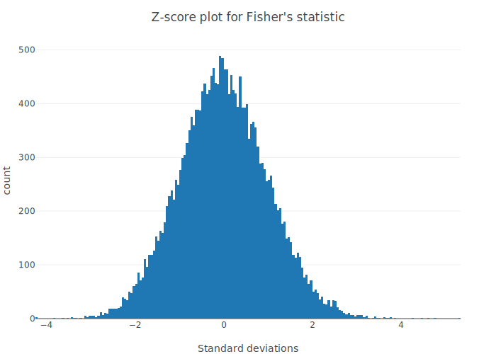

# Tutorial of MendelKinship 


```julia
versioninfo() # system info for reproducibility
```

    Julia Version 1.5.0
    Commit 96786e22cc (2020-08-01 23:44 UTC)
    Platform Info:
      OS: macOS (x86_64-apple-darwin18.7.0)
      CPU: Intel(R) Core(TM) i9-9880H CPU @ 2.30GHz
      WORD_SIZE: 64
      LIBM: libopenlibm
      LLVM: libLLVM-9.0.1 (ORCJIT, skylake)


## Examples data

Input data for this tutorial can be obtained on [our Github](https://github.com/OpenMendel/MendelKinship.jl/tree/master/data/documentation_data), which were originally derived from the 1000 genome project. They contain 85 people and 253141 SNPs, half of which have maf$< 0.05$. Using these founders' genotype, we simulated 127 extra people, resulting in 27 pedigrees and 212 people. Although the 85 individuals are treated as founders, they were actually somewhat related, and this is reflected in the kinship comparison in the 2nd example below. For more information on this dataset, please see Mendel's documentation example 29.4. 

## Example 1: Theoretical Kinship Coefficient Calculation 

### Step 1: Preparing the pedigree files:
Recall what is a [valid pedigree structure](https://openmendel.github.io/MendelBase.jl/#pedigree-file). Note that we require a header line. The extension `.in` have no particular meaning. Let's examine (the first few lines of) such an example:


```julia
;head -10 "Ped29a.in"
```

    Pedigree,Person,Mother,Father,Sex,,,simTrait
      1       ,  16      ,          ,          ,  F       ,          ,  29.20564,
      1       ,  8228    ,          ,          ,  F       ,          ,  31.80179,
      1       ,  17008   ,          ,          ,  M       ,          ,  37.82143,
      1       ,  9218    ,  17008   ,  16      ,  M       ,          ,  35.08036,
      1       ,  3226    ,  9218    ,  8228    ,  F       ,          ,  28.32902,
      2       ,  29      ,          ,          ,  F       ,          ,  36.17929,
      2       ,  2294    ,          ,          ,  M       ,          ,  42.88099,
      2       ,  3416    ,          ,          ,  M       ,          ,  40.98316,
      2       ,  17893   ,  2294    ,  29      ,  F       ,          ,  35.55038,


### Step 2: Preparing the control file
A control file gives specific instructions to `MendelKinship`. To perform theoretical kinship calculation, an minimal control file looks like the following:


```julia
;cat "control_just_theoretical_29a.txt"
```

    #
    # Input and Output files.
    #
    pedigree_file = Ped29a.in
    #
    # Analysis parameters for Kinship option.
    #
    kinship_output_file = just_theoretical_output.txt

### Step 3: Run the analysis in Julia REPL or directly in notebook


```julia
# load packages
using MendelKinship, CSV

# run analysis without printing OpenMendel's default messages
Kinship("control_just_theoretical_29a.txt")

# import result into dataframe for closer inspection
# result = CSV.read("just_theoretical_output.txt")
```
     
     
         Welcome to OpenMendel's
         Kinship analysis option
     
     
    Reading the data.
    
    The current working directory is "/Users/biona001/.julia/dev/MendelKinship/docs/src/man".
    
    Keywords modified by the user:
    
      control_file = control_just_theoretical_29a.txt
      kinship_output_file = just_theoretical_output.txt
      pedigree_file = Ped29a.in
     
     
    Analyzing the data.
    
     
     
    Mendel's analysis is finished.
    


### Step 4: Interpreting the result

`MendelKinship` should have generated the file `just_theoretical_output.txt` in your local directory. One can directly open the file, or import into the Julia environment for ease of manipulation using the DataFrames package. The fourth column contains the desired theoretical kinship coefficient. The 5th column contains the (deterministically) estimated Delta7 matrix. The 6th through the 14 columns contain the (stochastically) estimated Jacquard's 9 identity coefficients.

## Example 2: Compare theoretical/empirical kinship values

When both pedigree structure and *complete* SNP information are available, we can compare theoretical/empirical kinship coefficients. In practice, however, we often have individuals without genotype information, but nevertheless must be included in the pedigree structure. `MendelKinship` does not handle this situation yet, but an analysis option that supports these data is being developed. For now you can impute genotypes but keep in mind that the relationship comparison for these individuals who lack all genotype information will not be meaningful.   

### Step 1: Prepare pedigree file and SNP data file

The pedigree file is the same as the pedigree file in the previous example. The SNP definition file requires a header row, and should have approprietely placed commas. It may be informative to compare the following SNP definition file with the original "SNP_def29a.in" in Mendel Option 29a. 


```julia
;head -10 "SNP_def29a_converted.txt"
```

    Locus,Chromosome,Basepairs,Allele1,Allele2
    rs3020701,19,90974,1,2
    rs56343121,19,91106,1,2
    rs143501051,19,93542,1,2
    rs56182540,19,95981,1,2
    rs7260412,19,105021,1,2
    rs11669393,19,107866,1,2
    rs181646587,19,107894,1,2
    rs8106297,19,107958,1,2
    rs8106302,19,107962,1,2


#### Non binary PLINK users

The SNP data files in this case must be stored in PLINK BED file in SNP-major format, with an accompanying SNP definition file. For an explanation of what these are, see [MendelBase documentation](https://openmendel.github.io/MendelBase.jl/).

#### Binary PLINK file users

If your have "data.bim", "data.bed", "data.fam" (i.e. the 3 triplet of PLINK files), then you can replace the 3 fields `snpdata_file`, `snpdefinition_file`, and `pedigree_file` in the next step with just 1 field:

`plink_input_basename = data`.

### Step 2: Preparing control file

The following control file tells MendelKinship to compare theoretical kinship and empirical kinship, and output 2 interactive plots stored in .html format. 


```julia
;cat "control_compare_29a.txt"
```

    #
    # Input and Output files.
    #
    snpdata_file = SNP_data29a.bed
    snpdefinition_file = SNP_def29a_converted.txt
    pedigree_file = Ped29a.in
    #
    # Analysis parameters for Kinship option.
    #
    compare_kinships = true
    kinship_plot = kinship_plot
    z_score_plot = z_score_plot

### Step 3: Running the analysis


```julia
# run analysis option without printing OpenMendel's default messages
Kinship("control_compare_29a.txt")

# import result into dataframe for closer inspection
# result = CSV.read("Mendel_Output.txt")
```

     
     
         Welcome to OpenMendel's
         Kinship analysis option
     
     
    Reading the data.
    
    The current working directory is "/Users/biona001/.julia/dev/MendelKinship/docs/src/man".
    
    Keywords modified by the user:
    
      compare_kinships = true
      control_file = control_compare_29a.txt
      kinship_plot = kinship_plot
      pedigree_file = Ped29a.in
      snpdata_file = SNP_data29a.bed
      snpdefinition_file = SNP_def29a_converted.txt
      z_score_plot = z_score_plot
     
     
    Analyzing the data.
    
    Kinship plot saved.
    Fisher's plot saved.
     
     
    Mendel's analysis is finished.
    


### Step 4: Interpreting the Result

Founders which have 0 theoretical kinships often exhibit a non-zero empirical kinship. In the first row, person 26732 and 264 have 0 theoretical kinship but their empirical kinship is pretty close to 0.125 = 1/8. That is, these 2 people which we initially thought are unrelated, may be half siblings, grandparent-grandchild, or an avuncular pair. On the otherhand, the 8th row has a founder pair that has a $-0.08$ kinship (i.e. they are very *un*related), suggesting that the standard deviation of the moments estimator may have a wide spread. There may also have been a sample mix up. Another explanation is that we are only using one chromosome's worth of data and so the estimates of kinship may be imprecise. 

## Interactive Plots and Tables

`MendelKinship` automatically generates 2 figures and 1 table to allow the user to easily compare theoretical and empirical kinship, detect outliers, and observe skewnesses in distribution. Figures are saved in `.html` format to enable interactive sessions. To summarize, 

+ The table containing all the pairwise kinship and theoretical comparisons is stored in `kinship_file_output.txt`. The table is sorted in descending order of the largest deviance between the theoretical and empiric kinship. The last column lists the [Fisher's Z statistic](https://en.wikipedia.org/wiki/Fisher_transformation) (i.e. the number of standard deviations away from mean). 
    
+ The 2 plots are stored in .html format, which should be automatically be generated in your directory. These figures can be examined interactively via jupyter notebook, as demonstrated below, or opened directly via the browser.

### Generated Interactive Plots part 1:

The first interactive plot allows user to quickly identify which pairs of persons have an empirical kinship most deviated from their expected (theoretical) kinship. The midpoint is placed as an orange dot for interpretability. As an example, the first row in the table above is the highest point on the left most spread. Careful readers might observe that there is a wider spread on those with 0 expected theoretical kinship. This is expected, because most people are not related to each other, so we are making many more comparisons that have 0 expected kinship. 


```julia
using PlotlyJS, CSV

#import the files created from the previous example
result = CSV.read("kinship_file_output.txt")
name = Vector{String}(undef, size(result, 1))

# label the data points according to the persons names
for i in 1:length(name)
    name[i] = "Person1=" * string(result[i, 3]) * ", " * "Person2=" * string(result[i, 4])
end

#create interactive graph
function compare_kinship_plot()
    trace1 = scatter(;x=result[:theoretical_kinship], 
        y=result[:empiric_kinship], mode="markers", 
        name="empiric kinship", text=name)
    
    trace2 = scatter(;x=[1/2, 1/4, 1/8, 1/16, 1/32, 1/64, 1/128, 0.0],
        y=[1/2, 1/4, 1/8, 1/16, 1/32, 1/64, 1/128, 0.0], 
        mode="markers", name="marker for midpoint")
        
    layout = Layout(;title="Compare empiric vs theoretical kinship",hovermode="closest", 
        xaxis=attr(title="Theoretical kinship (θ)", showgrid=false, zeroline=false),
        yaxis=attr(title="Empiric Kinship", zeroline=false))
    
    data = [trace1, trace2]
    plot(data, layout)
end

# generate plot by this command
# compare_kinship_plot()
```


    compare_kinship_plot (generic function with 1 method)


If you call `compare_kinship_plot()`, you should get an interactive plot that looks like:


### Generated Interactive Plots part 2:

After comparing the theoretical and empirical kinships, as in the previous graph or through the outputted table directly, often one may wonder whether the observed differences between the two statistics are significantly different. As explained in our main OpenMendel paper (section 7), this difference can be precisely quantified by the Fisher's z transformation, which should give us samples from a standard normal distribution $N(0, 1)$. We ploted this statistic in plot 2, and at first glance, the distribution is approximately normal. In Julia, we can easily verify this by computing some summary statistics:


```julia
function fishers_transform()
    trace1 = histogram(x=result[:fishers_zscore], text=name)
    data = [trace1]
    
    layout = Layout(barmode="overlay", 
        title="Z-score plot for Fisher's statistic",
        xaxis=attr(title="Standard deviations"),
        yaxis=attr(title="count"))
    
    plot(data, layout)
end

# generate plot by this command
# fishers_transform()
```


    fishers_transform (generic function with 1 method)


If you call `fishers_transform()`, you should get an interactive plot that looks like:



### Compute mean and variance

We can verify that the Fisher's statistic is approximately normal by checking its 1~4th moments:


```julia
using Statistics, StatsBase

my_zscore = convert(Vector{Float64}, result[:fishers_zscore])
mean(my_zscore), var(my_zscore)
```


    (-1.2084702388691578e-16, 1.0)


### Compute skewness and excess kurtosis


```julia
skewness(my_zscore), kurtosis(my_zscore)
```


    (0.0923976421835524, 0.10657222736224581)


## Conclusions
MendelKinship provides a rapid way to calculate the theoretical kinship, which requires accurate pedigrees. Calculation of empirical kinships is also possible if genotypes at multiple markers are availble. Further, it can compare these kinships using Fisher's Z statistic when both the pedigrees and markers are available. 
